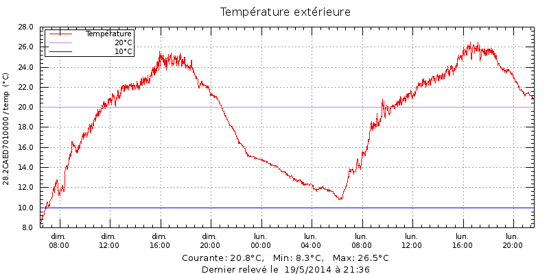

Graphe Gnuplot à partir de logs xPL
===================================

Description
-----------

Gnuplot est un logiciel qui sert à produire des représentations graphiques en deux ou trois dimensions de fonctions numériques ou de données. Le programme fonctionne sur de nombreux ordinateurs et systèmes d'exploitation (Linux, Windows, ...) et peut envoyer les graphiques à l'écran ou dans des fichiers dans de nombreux formats.(Dixit Wikipedia)

Le fichier log xPL est généré par le script perl de la libxpl xpl-logger. On retouve les données pour un "device" 1-wire particulier (28.2CAED7010000) avec un "grep" sous cette forme:

    # Log: /var/log/xpl/xpl-logger.log
    2014-04-09 01:26:10  xpl-trig { hop=1 source=domogik-ow_hbhts.rpi target=* } sensor.basic { device=28.2CAED7010000 type=temp current=6.8 } 
    2014-04-09 01:27:11  xpl-trig { hop=1 source=domogik-ow_hbhts.rpi target=* } sensor.basic { device=28.2CAED7010000 type=temp current=6.8 } 
    2014-04-09 01:28:14  xpl-trig { hop=1 source=domogik-ow_hbhts.rpi target=* } sensor.basic { device=28.2CAED7010000 type=temp current=6.8 } 
    2014-04-09 01:29:15  xpl-trig { hop=1 source=domogik-ow_hbhts.rpi target=* } sensor.basic { device=28.2CAED7010000 type=temp current=6.8 } 
    2014-04-09 01:30:17  xpl-trig { hop=1 source=domogik-ow_hbhts.rpi target=* } sensor.basic { device=28.2CAED7010000 type=temp current=6.8 } 
    2014-04-09 01:32:21  xpl-trig { hop=1 source=domogik-ow_hbhts.rpi target=* } sensor.basic { device=28.2CAED7010000 type=temp current=6.7 } 
    2014-04-09 01:33:23  xpl-trig { hop=1 source=domogik-ow_hbhts.rpi target=* } sensor.basic { device=28.2CAED7010000 type=temp current=6.8 } 
    2014-04-09 01:34:25  xpl-trig { hop=1 source=domogik-ow_hbhts.rpi target=* } sensor.basic { device=28.2CAED7010000 type=temp current=6.7 } 
    2014-04-09 01:35:26  xpl-trig { hop=1 source=domogik-ow_hbhts.rpi target=* } sensor.basic { device=28.2CAED7010000 type=temp current=6.7 } 
    2014-04-09 01:36:28  xpl-trig { hop=1 source=domogik-ow_hbhts.rpi target=* } sensor.basic { device=28.2CAED7010000 type=temp current=6.7 } 

Pour générer un graphe pour ces données, nous n'auront besoin que des champs "date", "heure" et "current" à produire sous cette forme:

    # DATA à convertir pour Gnuplot sous la forme:
    2014-04-09 01:26:10;6.8
    2014-04-09 01:27:11;6.8
    2014-04-09 01:28:14;6.8
    2014-04-09 01:29:15;6.8
    2014-04-09 01:30:17;6.8
    2014-04-09 01:32:21;6.7
    2014-04-09 01:33:23;6.8
    2014-04-09 01:34:25;6.7
    2014-04-09 01:35:26;6.7
    2014-04-09 01:36:28;6.7

Les données utiles sont extraites de la 'log' et placées dans une variable DATA utilisée par gnuplot dans le même programme.

Script Bash
-----------

Voici le script bash permettant de générer le graphe: [mk_gnuplot-graphs.sh](images/mk_gnuplot-graphs.sh)

Image générée
-------------

---
*18/6/2014*
